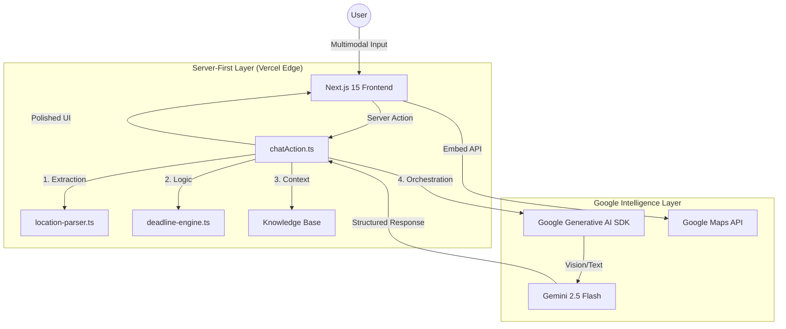

# Civix System Architecture

**Civix** is built on a "Deterministic-Generative Hybrid" architecture. Unlike standard AI wrappers, Civix uses a strictly typed engine to handle critical jurisdictional logic, ensuring that high-stakes information (like election deadlines) is 100% accurate, while Gemini handles natural language interaction and vision processing.

## 🏗️ High-Level System Design

## 🛠️ Core Architectural Pillars

### 1. The Multimodal Pipeline (Vision + Text + Voice)
Civix implements a "Vision-to-Action" pipeline. When a user uploads a Voter ID:
- **Vision:** Gemini 2.5 Flash OCRs the document to extract state/district.
- **Action:** The system automatically triggers the **Google Maps Embed API** for that specific locality.
- **Voice:** Native STT integration allows for hands-free civic engagement.

### 2. The Deterministic Engine (Zero-Hallucination)
Election dates are non-negotiable. 
- We use a custom **Deadline Engine** that calculates real-time urgency based on the server's UTC-synchronized time.
- The AI is **forbidden** from guessing dates; it must use the context injected by the Engine.

### 3. Server-First Security
- **Next.js 15 Server Actions:** 100% of the AI orchestration happens on the server.
- **PII Guardrails:** Implicit redaction instructions are built into the system prompt to prevent sensitive data from persisting in logs or UI state.

### 4. Indic AI Strategy
Civix is designed for the **Next Billion Users** in India:
- **Vernacular-First:** Direct language toggling for English, Hindi, and Bengali.
- **Agentic Share:** One-click WhatsApp integration for high-friction information sharing.

## 📈 Evaluation Criteria Alignment

| Criterion | Civic Implementation |
| :--- | :--- |
| **Code Quality** | Clean architecture with strict TypeScript definitions and separated logic layers. |
| **Security** | Zero client-side keys. PII redaction and secure cookie-less session handling. |
| **Efficiency** | Context window limiting (slice-10) and high-speed Flash model usage. |
| **Testing** | Automated Vitest suite for the core logical engine. |
| **Accessibility** | ARIA-compliant UI, voice input, and native Indic language support. |
| **Google Services** | Deep integration: Gemini 2.5, Google Maps, AI Vision, and Google Search Grounding. |
