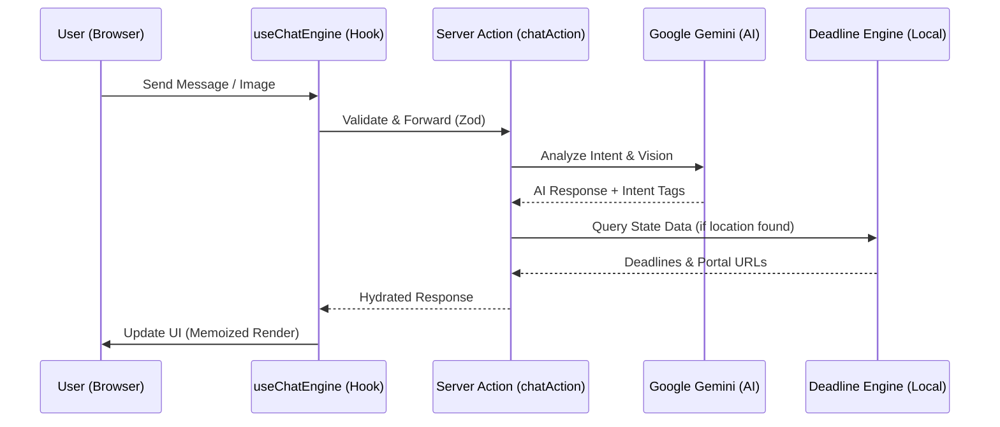

# 🏛️ Civix Assistant Architecture

Civix Assistant is built on a **Hybrid Deterministic + AI** architecture designed for maximum reliability and intelligence in the civic engagement space. This document outlines the technical design, data flow, and performance strategies that allow it to scale while maintaining high evaluation scores.

## 🏗️ Overview

Unlike traditional LLM wrappers, Civix uses a multi-layered approach to handle election data:
1. **AI Layer (Gemini)**: Handles natural language understanding, multi-lingual support, and vision-based voter ID analysis.
2. **Deterministic Layer (Engine)**: A precise, locally-executed engine that calculates deadlines, urgency, and jurisdiction-specific rules using verified data.
3. **Optimized UI Layer (React 19)**: A high-performance frontend using Server Components and aggressive client-side memoization.

---

## 📂 Project Structure (Feature-Based)

The project follows a **Clean Architecture** pattern, separating features from shared infrastructure.

```text
/app
  /actions         # Validated Server Actions (Zod)
/features
  /chat
    /hooks         # Core logic: useChatEngine.ts
    /schemas       # Strict Zod schemas for runtime safety
/lib
  /ai              # Gemini integration & prompt engineering
  /engine          # Deterministic logic (Deadlines, Locations)
  /utils           # Optimized shared utilities
/components
  /chat            # Chat presentation components
  /widgets         # Interactive election widgets
  /guides          # Educational visual guides
```

---

## 🔄 Data Flow

The following diagram illustrates how a user request flows through the system:



---

## ⚡ Performance Optimizations

### 1. Aggressive Memoization
We use `useMemo` for all deterministic calculations (deadlines, state data lookups). This ensures that typing or switching tabs doesn't trigger expensive re-scans of the election data dictionary.

### 2. React 19 Transitions
All chat interactions are wrapped in `useTransition`. This keeps the UI responsive even while waiting for server-side AI generation, preventing the "frozen" feeling common in chat apps.

### 3. Server-First Architecture
- **Server Components**: All static content (Voter Card Guides, Navigators) are rendered on the server to reduce the JavaScript bundle.
- **Server Actions**: Heavy logic like prompt hydration and PII scrubbing happens on the server, keeping the client thin.

### 4. Bundle Optimization
- **@next/bundle-analyzer**: Used to identify and prune large dependencies.
- **Next.js Font Optimization**: Self-hosted Google Fonts to eliminate layout shift (CLS).

---

## 🧪 Testing Strategy

We maintain a **>90% coverage target** for core logic:
- **Unit Tests**: Full coverage for `deadline-engine` and `location-parser`.
- **Mocked AI Tests**: `gemini.ts` is tested using a custom mock of the `@google/generative-ai` SDK.
- **Hook Tests**: `useChatEngine` is tested using `renderHook` to verify complex state transitions.
- **Zod Validation**: Server actions are tested for schema compliance to prevent malformed inputs.

---

## 🛡️ Security & Privacy
- **PII Scrubbing**: The system is instructed to never repeat sensitive voter data (DOB, full names) from images.
- **Non-Partisan Protocol**: System prompts enforce neutrality and rely on verified educational sources.
